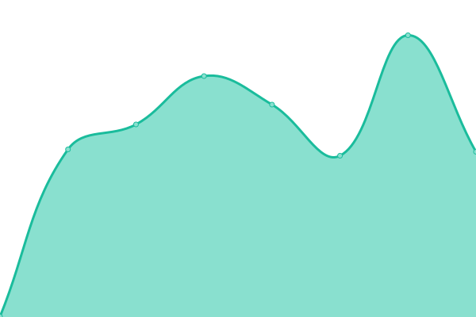

# [📈 Live Status](https://cboettcher.github.io/eflows4HPC_WP2_Service_Monitor): <!--live status--> **🟧 Partial outage**

This repository contains the open-source uptime monitor and status page for [Christian Böttcher](https://cboettcher.github.io/eflows4HPC_WP2_Service_Monitor), powered by [Upptime](https://github.com/upptime/upptime).

With [Upptime](https://upptime.js.org), you can get your own unlimited and free uptime monitor and status page, powered entirely by a GitHub repository. We use [Issues](https://github.com/cboettcher/eflows4HPC_WP2_Service_Monitor/issues) as incident reports, [Actions](https://github.com/cboettcher/eflows4HPC_WP2_Service_Monitor/actions) as uptime monitors, and [Pages](https://cboettcher.github.io/eflows4HPC_WP2_Service_Monitor) for the status page.

<!--start: status pages-->
<!-- This summary is generated by Upptime (https://github.com/upptime/upptime) -->
<!-- Do not edit this manually, your changes will be overwritten -->
<!-- prettier-ignore -->
| URL | Status | History | Response Time | Uptime |
| --- | ------ | ------- | ------------- | ------ |
|  [Unity - SSO Provider](https://zam10045.zam.kfa-juelich.de:7000/home/) | 🟩 Up | [unity-sso-provider.yml](https://github.com/cboettcher/eflows4HPC_WP2_Service_Monitor/commits/HEAD/history/unity-sso-provider.yml) | 

 601ms
     
 | 

<a href="https://cboettcher.github.io/eflows4HPC_WP2_Service_Monitor/history/unity-sso-provider">100.00%</a>
    

|  [Datacatalogue - Production](https://datacatalogue.eflows4hpc.eu) | 🟩 Up | [datacatalogue-production.yml](https://github.com/cboettcher/eflows4HPC_WP2_Service_Monitor/commits/HEAD/history/datacatalogue-production.yml) | 

 837ms
     
 | 

<a href="https://cboettcher.github.io/eflows4HPC_WP2_Service_Monitor/history/datacatalogue-production">100.00%</a>
    

|  [DLS - Production](https://datalogistics.eflows4hpc.eu) | 🟩 Up | [dls-production.yml](https://github.com/cboettcher/eflows4HPC_WP2_Service_Monitor/commits/HEAD/history/dls-production.yml) | 

 1243ms
     
 | 

<a href="https://cboettcher.github.io/eflows4HPC_WP2_Service_Monitor/history/dls-production">100.00%</a>
    

|  [Model Repository](https://modelrepository.eflows4hpc.eu) | 🟩 Up | [model-repository.yml](https://github.com/cboettcher/eflows4HPC_WP2_Service_Monitor/commits/HEAD/history/model-repository.yml) | 

 836ms
     
 | 

<a href="https://cboettcher.github.io/eflows4HPC_WP2_Service_Monitor/history/model-repository">100.00%</a>
    

|  [Image Creation Service](https://eflows4hpc.bsc.es/image_creation/login) | 🟩 Up | [image-creation-service.yml](https://github.com/cboettcher/eflows4HPC_WP2_Service_Monitor/commits/HEAD/history/image-creation-service.yml) | 

 571ms
     
 | 

<a href="https://cboettcher.github.io/eflows4HPC_WP2_Service_Monitor/history/image-creation-service">100.00%</a>
    

|  [Datacatalogue - Testing](https://zam10036.zam.kfa-juelich.de) | 🟩 Up | [datacatalogue-testing.yml](https://github.com/cboettcher/eflows4HPC_WP2_Service_Monitor/commits/HEAD/history/datacatalogue-testing.yml) | 

 611ms
     
 | 

<a href="https://cboettcher.github.io/eflows4HPC_WP2_Service_Monitor/history/datacatalogue-testing">100.00%</a>
    

|  [DLS - Testing](https://zam10115.zam.kfa-juelich.de) | 🟥 Down | [dls-testing.yml](https://github.com/cboettcher/eflows4HPC_WP2_Service_Monitor/commits/HEAD/history/dls-testing.yml) | 

 0ms
     
 | 

<a href="https://cboettcher.github.io/eflows4HPC_WP2_Service_Monitor/history/dls-testing">0.00%</a>
    

|  [Datacatalogue - Validation](https://eflows4hpc.bsc.es/datacatalogue/index.html) | 🟩 Up | [datacatalogue-validation.yml](https://github.com/cboettcher/eflows4HPC_WP2_Service_Monitor/commits/HEAD/history/datacatalogue-validation.yml) | 

 131ms
     
 | 

<a href="https://cboettcher.github.io/eflows4HPC_WP2_Service_Monitor/history/datacatalogue-validation">100.00%</a>
    

|  [DLS - Validation](https://eflows4hpc.bsc.es/datalogistics/) | 🟩 Up | [dls-validation.yml](https://github.com/cboettcher/eflows4HPC_WP2_Service_Monitor/commits/HEAD/history/dls-validation.yml) | 

 494ms
     
 | 

<a href="https://cboettcher.github.io/eflows4HPC_WP2_Service_Monitor/history/dls-validation">100.00%</a>
    

<!--end: status pages-->

[**Visit our status website →**](https://cboettcher.github.io/eflows4HPC_WP2_Service_Monitor)

## 📄 License

- Powered by: [Upptime](https://github.com/upptime/upptime)
- Code: [MIT](./LICENSE) © [Christian Böttcher](https://cboettcher.github.io/eflows4HPC_WP2_Service_Monitor)
- Data in the `./history` directory: [Open Database License](https://opendatacommons.org/licenses/odbl/1-0/)
